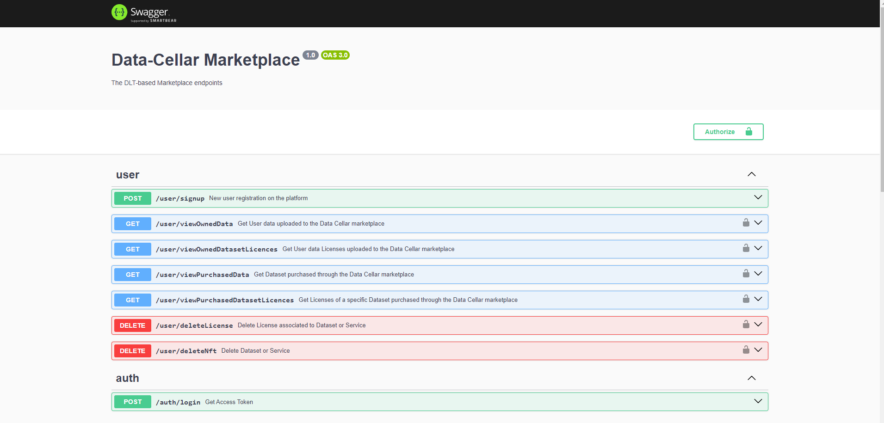
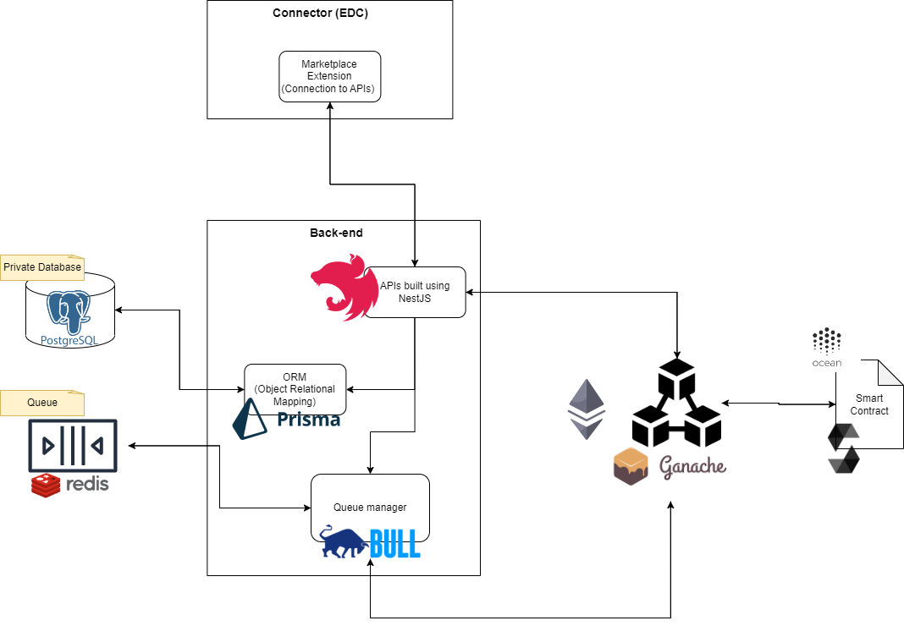

<a href="https://datacellarproject.eu/">
  
</a>

# DLT Data Marketplace

First prototype release of Data Marketplace based on DLT technology.
In this release, only a few reduced functionalities will be present in order to begin presenting the (partial) proposed architecture, through the use of docker containers for external services, and the logic based on Blockchain through the implementation of specific smart contracts.
The key aspect of the simulation will be the highlighting of the digitisation of energy data and their exchange between users through the purchase of one-time licences.
Below are the functionalities that will be made available:

- User registration to the DLT: assignment of an address (account) to the new user to enable him/her to buy and sell digital assets on the blockchain;​
- Visualisation of datasets and associated licenses (one-time license);​
- Upload of datasets and associated licenses (one-time license);​
- Purchased of licenses associated to Datasets (one-time license);
- Delete of licenses associated to Datasets and Datasets themself;
- Visualization of Data Cellar Token balance.

Here are the external services used through docker containers:

- Ganache: Simulated Blockchain;
- Postgres: SQL Database to store off-chain information;
- Redis: Queueu management.

## Table of Contents

- [Requirements](#requirements)
- [Installation](#installation)
- [Usage](#usage)
- [Project Structure](#project-structure)
- [Contributions](#contributions)
- [License](#license)

## Requirements

System requirements:

- **Operating System**: Windows 10/11, Linux Ubuntu distribution 20.04/22.04 LTS. 
<span style="color: red;">It has not been tested on MacOS. It might work but we do not guarantee</span>;
- **Memory**: at least 4 GB of RAM;
- **Processor**: 64 bit, Intel Core i5 or more;

Software packages requirements:

<table>
  <tr style="background-color: lightgreen;">
    <td align="center">Packages</td>
    <td align="center">Installation guide</td>
  </tr>
  <tr>
    <td><b>NodeJS</b>: v18.17.*</td>
    <td rowspan="2" align="center">We suggest nvm (Node Version Manager)<p></p>[Windows](https://github.com/coreybutler/nvm-windows) | [Linux](https://gist.github.com/d2s/372b5943bce17b964a79)</td>
  </tr>
  <tr>
    <td><b>npm</b>: v9.6.*</td>
  </tr>
  <tr>
    <td><b>Docker</b>: v24</td>
    <td align="center">[Windows](https://docs.docker.com/desktop/install/windows-install/) | [Linux](https://docs.docker.com/engine/install/ubuntu/)</td>
  </tr>
  <tr>
    <td><b>docker-compose</b>: v2.21</td>
    <td align="center">[Linux](https://docs.docker.com/compose/install/linux/)</td>
  </tr>
  <tr>
    <td><b>git</b>: v2.41</td>
    <td align="center"> [Windows](https://git-scm.com/book/it/v2/Per-Iniziare-Installing-Git) | [Linux](https://git-scm.com/book/it/v2/Per-Iniziare-Installing-Git)</td>
  </tr>
</table>

The versions of the packages are those that are used to build the system and on which one is certain to function correctly. This doesn't exclude that older or later versions may work.

To verify the correct installation of all packages, write the following commands from the CLI:

```bash
$node --versions
v18.17.1
```
Repeat the same command for the other installed packages.

## Installation

Two sections follow, one for manual installation and one automatic through the execution of a bash script:

### Manual Installation

The first thing is to clone the current repository from command line:

```bash
$git clone https://gitlab.com/FutureCitiesCommunities/Blockchain/data-cellar/backendapis.git
```
If you encounter problems during cloning, download the repository or e-mail one of the project authors.

Access the project root directory in which you should find the <ins>docker-compose.yml</ins> file.  

```bash
$cd project/root/path
```

Install all project dependencies

```bash
$npm install
```

Download and enable all the container through Docker

```bash
$docker compose up -d
```
To verify that containers have indeed been made available on your local machine, run the command

```bash
$docker ps

CONTAINER ID   IMAGE                              COMMAND                  CREATED         STATUS         PORTS                    NAMES
ef8e2ac51e4b   trufflesuite/ganache-cli:v6.12.2   "node /app/ganache-c…"   5 seconds ago   Up 3 seconds   0.0.0.0:8545->8545/tcp   blockchain-DataCellar
83c82ab3d16e   postgres:16.0                      "docker-entrypoint.s…"   5 seconds ago   Up 3 seconds   0.0.0.0:5433->5432/tcp   postgres-DataCellar
98f425157be4   redis:7.2.2                        "docker-entrypoint.s…"   5 seconds ago   Up 3 seconds   0.0.0.0:6379->6379/tcp   redis-DataCellar
```
We are shown the list of services available locally within docker containers. In particular, we have 3 services:

- **Ganache**: an Ethereum-based private blockchain simulation listening on local port 8545;
- **Postgres**: the offchain database for storing user information accessible on port 5432;
- **Redis**: the service for initialising and using queues for handling requests on the blockchain listening on port 6379.

Initialize Database with following command

```bash
$npx prisma migrate dev


Applying migration `20231219140333_`

The following migration(s) have been applied:

migrations/
  └─ 20231219140333_/
    └─ migration.sql

Your database is now in sync with your schema.

✔ Generated Prisma Client (v5.7.0) to ./src/prisma/client in 52ms
```

Now exit the repository from the command line and clone the smart contract repository (**branch main**):

```bash
$cd ..
$git clone https://gitlab.com/FutureCitiesCommunities/Blockchain/data-cellar/smartcontracts.git
```
Follow the repository's instructions (installation section) for successful installation of Smart Contracts on the local private blockchain

At this point the contracts are deployed on the blockchain. However, it is still necessary to upload in this repo the abi of the various contracts, otherwise we will not be able to call up and use the functions they expose. You can copy it through cmd or manually as you prefer.

```bash
$cd /root/to/smartcontracts/repo
$cp build/contracts/ERC721template.json ../backendapis/src/utils/misc
$cp build/contracts/ERC20template.json ../backendapis/src/utils/misc
$cp build/contracts/FactoryERC721.json ../backendapis/src/utils/misc
$cp build/contracts/DataCellarToken.json ../backendapis/src/utils/misc
```

Once this is done, return to the current repository path and start the server listening on port 3000:

```bash
$cd path/to/project
$npm run start

2023-10-26T13:35:27.818Z info:     Starting Nest application...
2023-10-26T13:35:27.865Z info:     TypeOrmModule dependencies initialized
2023-10-26T13:35:27.866Z info:     BullModule dependencies initialized
[...]
2023-10-26T13:35:28.009Z info:     Mapped {/public/viewAllMrktplaceData, GET} route
2023-10-26T13:35:28.009Z info:     Mapped {/public/viewMrktDatasetLicences, GET} route
2023-10-26T13:35:28.013Z info:     Nest application successfully started
```

Now you can navigate to [localhost:3000](http://localhost:3000/api). You will see the swagger with APIs list:



### Automatic Installation

It is possible to install all the dependencies and operations described above automatically using the bash script provided.
Remember to grant rights to run and read and write information on your PC.

- In **Windows**, you can do this by right-clicking on the file -> properties -> Security -> Edit... -> \[set permissions] -> Apply -> OK
- In **Linux**, from CLI, execute this command:

  ```bash
  $chmod 777 installation.sh
  ```
Once the changes have been made, run the bash script

```bash
$bash installation.sh
```
The script should start up and begin to perform the required operations to install all the various dependencies, you will see messages during execution that will keep you updated on the overall progress. When finished, you can test the marketplace by accessing from your browser at [localhost:3000](http://localhost:3000/api).

## Usage

- TODO

## Project Structure

Here we can find listed information about the project structure and organisation of the architecture.

### Folder Structure

    .
    ├── dist                      # Compiled files
    ├── prisma                    # Migration file for database initialisation
    ├── img                       # Images for README documentation
    └── src                       # Source files
        ├── auth                  # Authentication functionality
        ├── blockchain            # Blockchain interactions functionality
        ├── blockchain-public     # Blockchain interactions for public assets
        ├── logger                # Logging files storage
        ├── middleware            # Middleware to enable logger
        ├── user                  # User module 
        ├── utils                 # Smart contracts ABI
        ├── prisma                # Connection with database
        └──[...]
    ├── test                    # Automated tests (empty at the moment)
    ├── .env                   # Environment file
    ├── docker-compose.yml     # Enable services through docker
    ├── Dockerfile             # Creation of project image (to be tested)
    ├── installation.sh        # Automatic installation
    ├── LICENSE
    └── README.md

It is important to remember that the project has been developed using nestJS, so we will find all the files defining the routes (i.e. modules) and services inside the src/ folder and the compiled files in the dist/ folder.

### Environment variables

- `POSTGRES_PASSWORD`: Postgres password to access to database and perform operations
- `POSTGRES_USER`: Username to access to postgres database
- `POSTGRES_DB`: Postgres database name to store local information
- `redisHost`: Redis docker container name
- `JWT_SECRET`: secret string to generate JWT to protect endpoint
- `encryption_KEY`: secret key to encrypt data before write them on database
- `factory_ADDRESS`: Public address of FactoryERC721 contract
- `dct_ADDRESS`: Public address of DataCellarToken contract 
- `owner_ADDRESS`: Public address of the admin (and owner) of Data Cellar
- `privateKEY`: Private Key of the admin


### Marketplace Architecture





### Back-end Infrastructure

Back-end inrastructure is composed by following components:

- **APIs endpoint**: This turns out to be the core component of the entire architecture as it is the conduit that enables and makes available the various functionalities of the marketplace. It is developed in Typescript language using the [NestJS](https://nestjs.com/) framework. 
- **Database**: Built using [PostgreSQL](https://www.postgresql.org/) database. Here we will store User information identity. They are encrypted through a specific private key to prevent leakage of information in the event of database attacks.
- **ORM (Object Relational Mapping)**: It is responsible to initialize tables on PostgreSQL to store data. We use [Prisma](https://www.prisma.io/) framework. At the moment we have only a single table, but in future we will store more off chain information and it will be important to map everything in the right way with specific tables.
- **Queue**: We use [Redis](https://redis.io/) to initialize a queue to manage all the transactions generated by users of the platform on the Blockchain. The queue is managed by [Bull](https://www.npmjs.com/package/bull) module and it is responsible to create the transactions model to be executed on the Blockchain, in agreement with the logic written on smart contract, and the decision on the priority of the various requests in the queue. This is of essential importance to avoid congestion on the blockchain network that would lead to a high degradation of transaction execution speed.We have maximum control over the maximum number of transactions that can be running at the same time on the blockchain.

### Blockchain Infrastructure

Blockchain infrastructure is composed by following components:

- **Blockchain network**: For this prototype, we do not have a real Blockchain network, but rather a component that simulates its real behaviour: [Ganache](https://trufflesuite.com/ganache/). In fact, it is a private blockchain based on Ethereum. It proves to be the best choice for developing a data marketplace that needs to enable the digitisation of data through specific logic (smart contracts).
- **Smart contract**: It is the logic built on the Blockchain infrastructure made available. Smart contracts are written in Solidity and enable data digitisation and the exchange of resources through particular tokenomics. For further explanation follow this [link](https://gitlab.com/FutureCitiesCommunities/Blockchain/data-cellar/smartcontracts).

## Contributions

- Author - [Alessandro Mozzato](https://it.linkedin.com/in/alessandro-mozzato-32479420b?trk=people-guest_people_search-card), [Silvio Meneguzzo](https://www.linkedin.com/in/silvio-arras-meneguzzo-a29681127/), [Alfredo Favenza](https://www.linkedin.com/in/alfredofavenza/)
- Company - [Fondazione LINKS](https://linksfoundation.com/)

## License

The Data Cellar DLT Marketplace is [MIT licensed](LICENSE).
